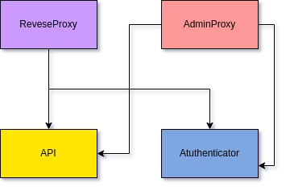
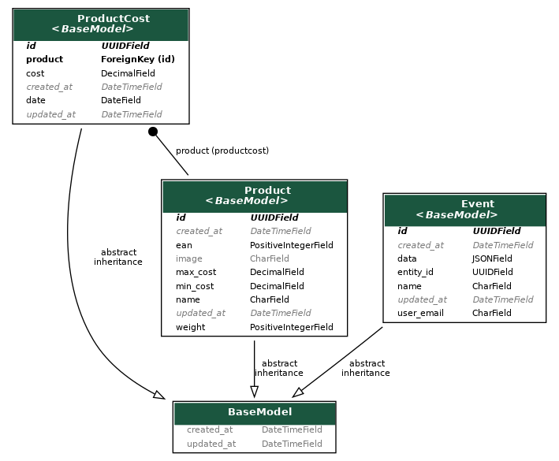

# Desafio tradex

## Fluxo de processamento

O projeto foi construído utilizando o framework Django Rest Framework. Ele está dividido em 2 serviços: A ```API```, que é responsável por salvar e listar os produtos, bem como as variações de preço do mesmo; O ```Authenticator``` que é responsável por registrar e gerenciar os usuários logados no sistema. Os serviços se comunicam por meio de API Rest. O banco de dados utilizado para persistir as infomações foi o PostgreSQL.

Basicamente a ```API``` receberá os dados dos produtos a serem salvos e inicialmente irá checar no serviço de autenticação se o usuário que está tentando realizar a operação existe, se sim, salvará os dados, caso contrario retornará erro. A mesma coisa ocorre nas rotas de variação do preço de acordo com a [especificação do projeto](./README_BASE.md).

Os diagramas abaixo mostram a arquitetura do projeto explicada e o modelo do banco:



## Iniciando o projeto

### Dependências necessárias
Antes de executar o projeto é preciso certificar-se de ter algumas depências instaladas. Elas são: ```Python3``` (e o pip caso não esteja instalado), o ```Docker``` e o ```Docker Compose```.

### Executando o projeto
Depois de instaladas as dependências é possível iniciar o projeto. Para isso execute o seguinte comando:

```shell
make run
```

### Criando tabelas no banco
Após certificar-se de ter todas dependências instaladas e o projeto iniciado, é preciso popular o banco de dados com as tabelas que serão utilizadas. Para isso, basta executar na raíz do projeto o comando:

```shell
make migrate
```

OBS: Só é necessário executar esse comando na primeira vez que em for executar o projeto.


## Executando testes unitários
Para executar os testes unitários é necessário ter as dependências instaladas e o bando de dados construído (já explicado em etapas anteriores). Após isso, basta executar o comando:

```shell
make test
```

## Acessando documentação da API
Para acessar a documetação da api, é preciso executar o projeto e acessar a seguinte url: [http://localhost:8081/api/docs/schema/swagger-ui/](http://localhost:8081/api/docs/schema/swagger-ui/) e para acessar a documentação do serviço de autenticação acesse a seguinte url:  [http://localhost:8081/auth/docs/schema/swagger-ui/](http://localhost:8081/auth/docs/schema/swagger-ui/)

## Fluxo principal de uso

Inicialmente deve-se criar um novo usuário no serviço de autencitação na rota `/auth/register` (Já existem 3 usuários registrados, veja observação ao final do tópico). Após isso é preciso gerar o token de autenticação na rota `/auth/api-token-auth/`.
Depois de criado o usuário e gerado token, é possível usar as rotas de registro e listagem de produtos (`/api/product/`) e a rota variação de preços (`/api/cost/`)

OBS: Todas estas rotas podem ser testadas diretamente nas documentações da API.
OBS 2: Os usuários já cadastrados são: User01, User02, User03 e suas senhas são respectivamente: secret01, secret02, secret03.

### Criando um novo produto
Para criar um novo produto basta enviar uma requisição POST para a rota `/api/product/` com os dados exemplificados na documentação da API. Após isso é possível enviar a imagem do produto na rota `/api/product/{id}/upload_image/` com o campo file, assim como mostrado na documentação.

## Visualizando eventos gerados pelos usuários
Para visualizar os eventos gerados pelos usuários é preciso acessar o painel admin na seguinte url: [http://localhost:8082/api/admin/events/event/](http://localhost:8082/api/admin/events/event/). Para realizar o login use as seguintes credenciais:

```
username: root
pasword: secret
```

## Acessando painel admin
A fim de simular um ambiente de produção real, onde o painel admin é executado em uma url diferente da url da API de modo a gerar maior segurança no sistema, os painels admin dos seviços são executados nas seguintes urls:


[API admin](http://localhost:8082/api/admin/)

[Authenticator admin](http://localhost:8082/auth/admin/)

## Lista de comandos

```make migrate```: Inicia o banco de dados PostgreSQL e cria as tabelas necessárias.

```make run```: Inicia todos os serviços do projeto.

```make test```: Executa os testes unitários.

```make run-dependecies```: Inicia as dependências do projeto

```make logs```: Visualiza os logs dos serviços

```make down```: Encerra a execução dos serviços

```make down-dependecies```: Encerra a execução das dependências